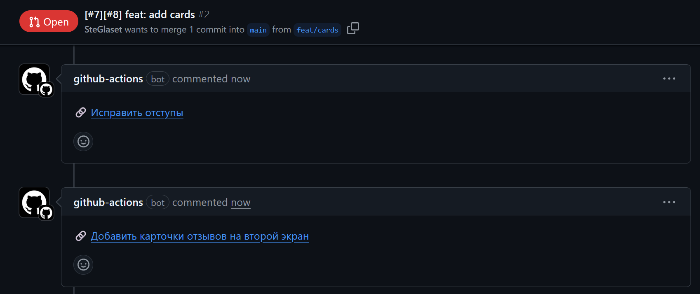

# 🖋 Weeek Task Link Action

## Description

This GitHub Action automatically adds a link to a Weeek task in the comments of a Pull Request if the task number is included in the PR title. It simplifies linking Weeek tasks to code changes, helping teams quickly locate the related tasks associated with each Pull Request.



## How It Works

1. The action extracts all task numbers from the Pull Request title using the format `[#{task_number}]`.
2. It queries the Weeek API to fetch each task’s title.
3. It removes previously added comments created by this action to keep the PR thread clean and up-to-date.
4. It adds a separate comment for each task,

## Example PR title
```
    [#123][#456] Improve login flow
```

## Usage Example

```yaml
name: Add Weeek task link to PR

on:
  pull_request:
    types: [opened, edited]

jobs:
  add-task-link:
    runs-on: ubuntu-latest

    permissions:
      contents: read
      pull-requests: write

    steps:
      - name: Add Weeek task link
        uses: SteGlaset/weeek-task-link-action@v1.0.0
        with:
          weeek_api_token: ${{ secrets.WEEEK_API_TOKEN }}
          workspace_id: ${{ secrets.WEEEK_WORKSPACE_ID }}
        env:
          GITHUB_TOKEN: ${{ secrets.GITHUB_TOKEN }}
```

## Requirements

* The Pull Request title must contain one or more task numbers in the format `[#{task_number}]`.
  Multiple tasks can be referenced like this: `[#{id1}][#{id2}]`
* A Weeek API token is required and should be stored as a secret `WEEEK_API_TOKEN` in the repository settings.
* The ID of your Weeek workspace is required and should be stored as a secret `WEEEK_WORKSPACE_ID`.
* The `GITHUB_TOKEN` environment variable must be set to `${{ secrets.GITHUB_TOKEN }}` for the action to manage comments

## Inputs

* `weeek_api_token` (required) — The API token to authenticate with Weeek.
* `workspace_id` (required) — The ID of your Weeek workspace.

## Outputs

* `task_number` — The task number extracted from the PR title.
* `task_title` — The task title retrieved from the Weeek API.

## Benefits

* 🧹 **Cleans up old comments** left by the action to avoid confusion from outdated links.
* 🔗 **Supports multiple task IDs**, adding one comment per task for better traceability.
* 📎 **Improves team visibility** by linking PRs directly to relevant tasks.
* 🚀 Automates project tracking without requiring manual updates in Weeek.

## License
This action is licensed under the MIT License.
